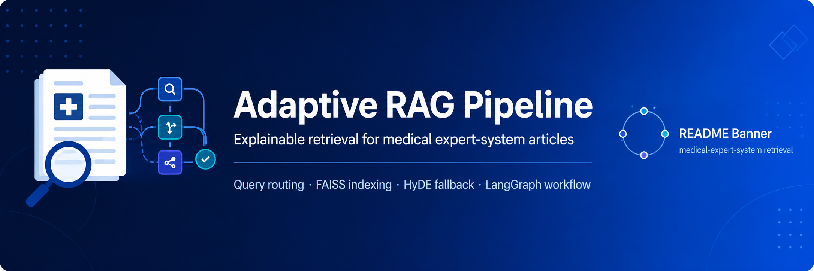
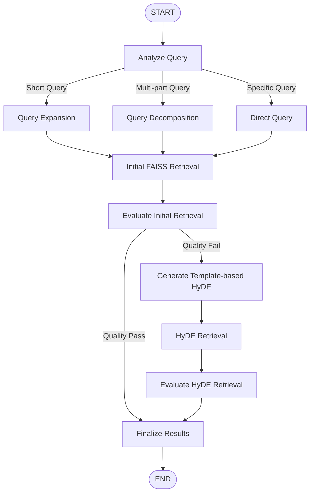

<p align="center">
  
</p>

<p align="center">
  
  
  
  
  
</p>

# Adaptive RAG Query Enhancement Explorer

An explainable Adaptive Retrieval-Augmented Generation pipeline for searching medical expert-system articles.

The application analyzes each user query, selects an appropriate query-enhancement strategy, retrieves relevant article chunks from a FAISS vector index, evaluates retrieval quality, and applies a one-time template-based HyDE fallback when the initial retrieval is weak.

> This project displays retrieved evidence and workflow decisions. It does not generate a final medical answer or provide medical advice.

---

## Key Features

- Deterministic and explainable query routing
- Query Expansion for short or underspecified queries
- Query Decomposition for complex multi-part queries
- Direct Retrieval for clear and specific queries
- Qwen3 text embeddings with 1024-dimensional vectors
- Exact cosine-similarity search using FAISS `IndexFlatIP`
- Coverage-aware merging for decomposed queries
- Configurable retrieval-quality evaluation
- One-time template-based HyDE fallback
- LangGraph workflow orchestration
- Resumable embedding and FAISS index construction
- Interactive Streamlit interface
- JSON export of results and execution traces

---

## Adaptive Workflow



HyDE is executed at most once. There is no edge that returns from the HyDE evaluation node to the HyDE generation node.

---

## Query Routes

### Query Expansion

Short queries may lack enough retrieval context.

Example:

```text
medical expert systems
```

The system expands the query with relevant concepts such as:

```text
clinical decision support
disease diagnosis
treatment recommendation
patient risk classification
```

### Query Decomposition

Queries containing multiple information needs are divided into focused subqueries.

Example:

```text
How do medical expert systems diagnose diseases,
recommend treatments, and classify patient risks?
```

Generated subqueries:

```text
How do medical expert systems diagnose diseases?
How do medical expert systems recommend treatments?
How do medical expert systems classify patient risks?
```

### Direct Retrieval

Clear queries with one primary information need are retrieved without transformation.

Example:

```text
How does a fuzzy expert system select a wart treatment method?
```

---

## Retrieval Quality Evaluation

The default quality configuration is:

| Parameter | Default |
|---|---:|
| Candidate K | 10 |
| Final Top K | 5 |
| Score threshold | 0.65 |
| Minimum accepted results | 2 |
| Minimum average score | 0.65 |

A retrieval result passes when:

1. Results are available.
2. At least two results meet the similarity threshold.
3. The average similarity score meets the configured minimum.
4. Every retrieval query or generated subquery is represented in the final results.

The similarity score is a normalized cosine-similarity value. It is not a probability or accuracy percentage.

---

## Template-based HyDE

When the initial retrieval fails the quality checks, the system creates a deterministic hypothetical medical passage.

The generated passage is embedded and used for one additional FAISS search.

```text
Initial retrieval
        ↓
Quality evaluation
        ↓
        Fail
        ↓
Template-based HyDE
        ↓
Second retrieval
        ↓
Final evaluation
        ↓
Stop
```

This project intentionally labels the method as `template_based_hyde` because the hypothetical document is generated using an explainable template rather than a generative LLM.

---

## Technology Stack

| Component | Technology |
|---|---|
| Programming language | Python 3.11 |
| Embedding model | Qwen/Qwen3-Embedding-0.6B |
| Embedding dimension | 1024 |
| Vector database | FAISS |
| Index type | IndexFlatIP |
| Similarity metric | Normalized inner product / cosine similarity |
| Workflow engine | LangGraph |
| User interface | Streamlit |
| PDF processing | PyMuPDF |
| Text splitting | Recursive character splitting |
| Checkpoint format | NumPy and JSON |

---

## Project Structure

```text
Adaptive_RAG_Pipeline/
├── app/
│   └── streamlit_app.py
├── assets/
│   └── readme_banner.png
├── configs/
├── data/
│   ├── raw_pdfs/
│   │   └── .gitkeep
│   ├── processed/
│   │   └── .gitkeep
│   ├── chunks/
│   │   └── .gitkeep
│   └── faiss_index/
│       └── .gitkeep
├── models/
├── scripts/
│   ├── prepare_dataset.py
│   ├── build_chunks.py
│   ├── build_index.py
│   ├── create_checkpoint_from_index.py
│   ├── test_embeddings.py
│   ├── test_retrieval.py
│   ├── test_query_analysis.py
│   ├── test_query_transformations.py
│   ├── test_adaptive_retrieval.py
│   ├── test_retrieval_evaluation.py
│   ├── test_hyde_generation.py
│   ├── test_hyde_fallback.py
│   ├── test_graph_workflow.py
│   └── test_real_graph_workflow.py
├── src/
│   └── adaptive_rag/
│       ├── adaptive_retrieval.py
│       ├── chunking.py
│       ├── config.py
│       ├── embeddings.py
│       ├── graph_workflow.py
│       ├── hyde.py
│       ├── hyde_fallback.py
│       ├── pdf_parser.py
│       ├── query_analyzer.py
│       ├── query_transformer.py
│       ├── retrieval.py
│       ├── retrieval_evaluator.py
│       └── vector_store.py
├── tests/
├── .gitignore
├── pyproject.toml
├── README.md
└── requirements.txt
```

The `models` directory and generated data files are excluded from Git.

---

## Installation

### 1. Clone the repository

```powershell
git clone <repository-url>
cd Adaptive_RAG_Pipeline
```

### 2. Create a virtual environment

```powershell
python -m venv .venv
```

### 3. Activate the environment

Windows PowerShell:

```powershell
.\.venv\Scripts\Activate.ps1
```

macOS or Linux:

```bash
source .venv/bin/activate
```

### 4. Upgrade pip

```powershell
python -m pip install --upgrade pip
```

### 5. Install dependencies

```powershell
pip install -r requirements.txt
pip install -e .
```

The Qwen3 embedding model is downloaded automatically during the first model execution and cached locally inside the ignored `models` directory.

---

## Preparing the Dataset

The original PDF articles are not included in this repository.

Place the PDF files inside:

```text
data/raw_pdfs/
```

Then run the following stages in order.

### 1. Parse PDF files

```powershell
python scripts/prepare_dataset.py
```

This produces extracted page records and a parsing report inside:

```text
data/processed/
```

### 2. Build text chunks

```powershell
python scripts/build_chunks.py
```

This produces chunk records and a chunking report inside:

```text
data/chunks/
```

### 3. Build the FAISS index

```powershell
python scripts/build_index.py
```

The resumable index builder creates:

```text
data/faiss_index/medical_expert_systems.index
data/faiss_index/chunk_metadata.jsonl
data/faiss_index/index_report.json
data/faiss_index/embeddings_checkpoint.npy
data/faiss_index/checkpoint_state.json
```

When a compatible complete checkpoint exists, document embedding generation is skipped.

---

## Running the Application

Start the Streamlit interface from the project root:

```powershell
python -m streamlit run app\streamlit_app.py
```

The application normally becomes available at:

```text
http://localhost:8501
```

The first query may take longer because the embedding model must be loaded. Later queries in the same Streamlit session reuse the cached model and FAISS index.

---

## Interface Output

For every query, the application displays:

- Original query
- Selected route
- Routing reason
- Query-analysis metrics
- Expanded query or generated subqueries
- Initial retrieval quality
- Final retrieval quality
- HyDE usage status
- Hypothetical document when HyDE is used
- Final retrieved chunks
- Similarity scores
- Accepted and rejected results
- Source PDF and page number
- Coverage information
- Full LangGraph execution trace
- JSON export of the complete run

---

## Example Queries

### Expansion route

```text
medical expert systems
```

Expected route:

```text
EXPANSION
```

### Decomposition route

```text
How do medical expert systems diagnose diseases,
recommend treatments, and classify patient risks?
```

Expected route:

```text
DECOMPOSITION
```

### Direct route

```text
How does a fuzzy expert system select a wart treatment method?
```

Expected route:

```text
DIRECT
```

### HyDE fallback example

```text
How can clinicians estimate the danger caused by medications
that alter the heart's electrical recovery process?
```

Typical behavior:

```text
Initial quality: FAIL
HyDE used: YES
Final quality: PASS
```

---

## Running Tests

### Query analysis

```powershell
python scripts/test_query_analysis.py
```

### Query transformations

```powershell
python scripts/test_query_transformations.py
```

### Direct retrieval

```powershell
python scripts/test_retrieval.py
```

### Adaptive retrieval

```powershell
python scripts/test_adaptive_retrieval.py
```

### Retrieval evaluation

```powershell
python scripts/test_retrieval_evaluation.py
```

### HyDE generation

```powershell
python scripts/test_hyde_generation.py
```

### One-time HyDE fallback

```powershell
python scripts/test_hyde_fallback.py
```

### LangGraph routing

```powershell
python scripts/test_graph_workflow.py
```

### Real end-to-end workflow

```powershell
python scripts/test_real_graph_workflow.py
```

The real integration test loads Qwen3 and the local FAISS index. The other workflow tests use deterministic synthetic retrieval results when possible.

---

## Current Local Experiment

The current local development dataset contains:

| Item | Count |
|---|---:|
| PDF articles | 9 |
| Extracted pages | 189 |
| Text chunks | 1,269 |
| Stored vectors | 1,269 |
| Vector dimensions | 1,024 |

These files are local development artifacts and are intentionally excluded from the Git repository.

---

## Data and Repository Policy

The repository does not include:

- Original research-paper PDFs
- Extracted article text
- Generated chunks
- FAISS index files
- Embedding checkpoints
- Downloaded model weights
- Hugging Face cache
- Virtual environments
- Environment variables or secrets

Users must provide their own legally accessible PDF documents and generate the local artifacts using the included scripts.

---

## Limitations

- Query routing is based on deterministic English-language heuristics.
- Expansion rules are currently focused on medical expert-system topics.
- Template-based HyDE is not generated by an LLM.
- Retrieval quality thresholds require calibration for different datasets.
- The application retrieves evidence but does not synthesize a final answer.
- The quality of results depends on the available PDF collection and extracted text.

---

## Educational Purpose

This project was developed as an educational implementation of an explainable Adaptive RAG pipeline.

Its main goal is to demonstrate how query analysis, query enhancement, vector retrieval, quality evaluation, fallback retrieval, and graph orchestration can be combined in a transparent and testable system.